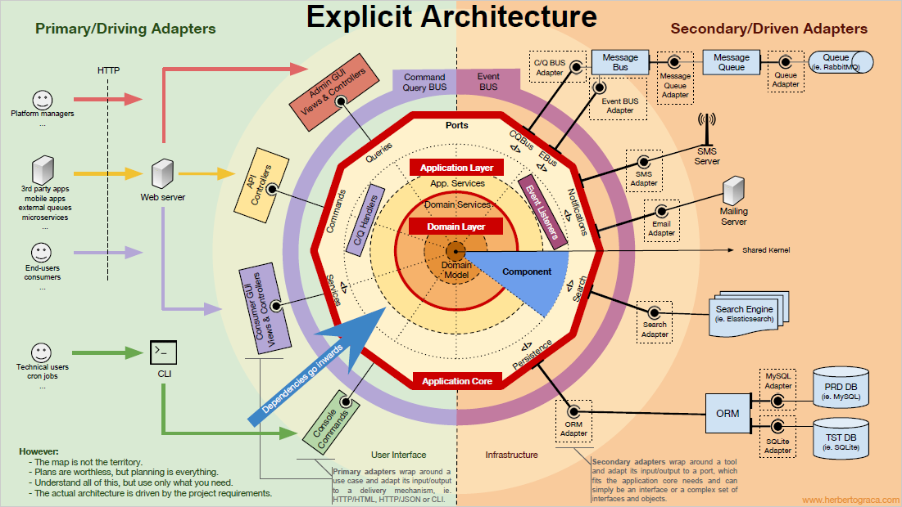
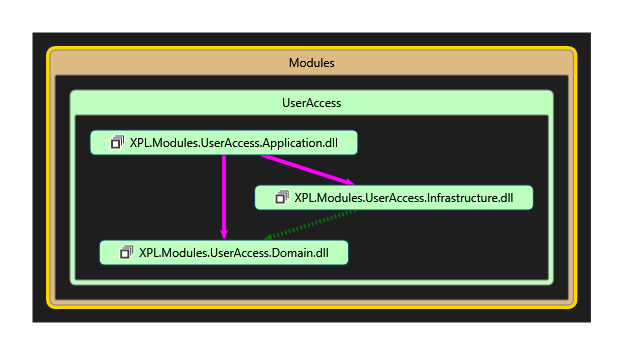
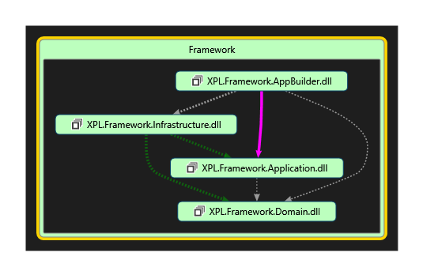
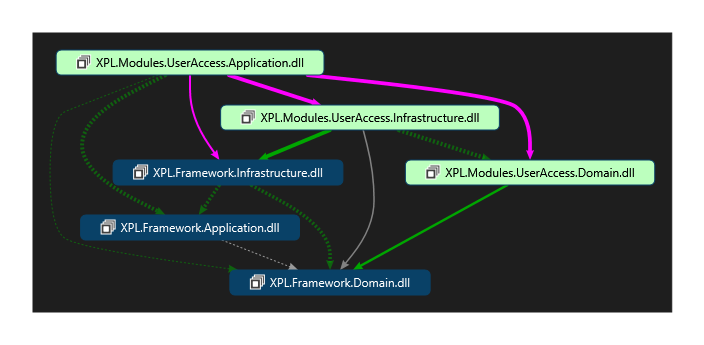

# Modular-Monolith with DDD - Multiple Clients

An example application and framework built in the modular monolith style with
a Domain-Driven Design approach, and Explicit Architecture.

## Why?

> In theory, theory and practice are the same. In practice, they are not.

I created this project as an exercise for myself to see if the way I imagined a modern architecture
actually played out that way when if sit down and code it up. *Unsurprisingly* I've learned a few things.

## Table of Contents

1. [Inspiration](#Inspiration)
2. [What You Should Know](#what-you-should-know)
   1. [Architecture](#architecture)
   2. [Code Style](#code-style)
3. [Code Quality](#code-quality)
4. [Explicit Architecture](#explicit-architecture)

----

### Inspiration

**This is not an original idea.**

I was most inspired to try something like this after stumbling
across [Kamil Grzybek](http://www.kamilgrzybek.com/)'s excellent
repo [Modular Monolith with DDD](https://github.com/kgrzybek/modular-monolith-with-ddd).

In that repository Kamil does essentially this exercise where he builds an entire application (instead of demo-ware).
I will not repeat all that he's done in that repo because (a) it's a lot and (b) you should read it for yourself.

However, I have poured over most of his source code and there are certain things, not represented there,
which are of particular interest to me.

----

### What You Should Know

Everybody has their own style of coding, but some are better than others. :smirk:

- I will be following all of the standard rules including GRASP practices, SOLID principles, and proper Object-Oriented Design.
- I will use C# 8's nullable reference types everywhere.
- Code will be defensive by design.

#### Architecture

The top-level architecture is [Herberto Graca](https://herbertograca.com/)'s
[**Explicit Architecture.**](https://herbertograca.com/2017/11/16/explicit-architecture-01-ddd-hexagonal-onion-clean-cqrs-how-i-put-it-all-together/)
I **strongly** recommend you read this series of articles.

#### Code Style

Object-Oriented Programming is the *transpose* of Functional Programming. 

OOP is good when you have lots of types which share behavior, or can be composed together.
- Adding a new **type** to a hierarchy is easy (one new class)
- Adding a new **method** to the top of a hierarchy is hard (every class which inherits this needs to be updated)

Functional Programming is good when you a lot of workflows on potentially disparate types
- Adding a new **function** is easy (one new function)
- Adding a new **type** is hard (every function that uses it needs to be updated)

So, there's a trade-off between the two which hinges around the likelihood of
having to add new behaviors to existing types in the system, or to add new types
with similar behaviors to the system.

That said, DDD tells us to use immutable value objects as much as possible. Similarly, functional
programming almost always focuses on immutable objects.

Because C# is OO-first, the solution will include plenty of objects, hopefully designed well. But, the
lessons learned from the functional-style should be used as much as possible. This includes things like honest
method signatures, Railway-Oriented programming, and a functional design.

If you can, I would recommend that you watch everything by [Zoran Horvat](http://www.codinghelmet.com/articles)
over on [Pluralsight](http://www.pluralsight.com/). A lot of similar information is found on his website as well.

----

### Code Quality

Qualities we want in our codebase:
1. **Maintainable** Making a change in one area of the system impacts only that area
2. **Extensible** Adding new behavior to the system involves writing new code, not modifying existing code
3. **Testable** The system is structured in such a way that tests can be easily written to verify behavior
4. **Modular** The system is packaged in such a way that distinct components are logically separate and reusable
5. **Encapsulated** Each module of the system has complete ownership over the data and behaviors it represents
6. **Discoverable** Looking at any module of the system should provide feedback about how it used and what it does

These code qualities apply at **all** leveles of software. More [here](docs/CodeQuality.md).

----

### Explicit Architecture

We will follow Uncle Bob's advice regarding keeping frameworks at arms length, and follow the clean architectures dependency rule.

At the same time, we do not want to re-invent the wheel every time we need to interact with a Module (Bounded Context), or add a new one.

We can achieve both of these at the same time by creating our own framework classes.

Because I'm following the *Explicit Architecture,* I'm using the *XPL* prefix for all classes. (Plus it's nice and short.)

#### Modules

In Modules (Bounded Contexts) the dependency rule is simple.

- The application layer refers to both the Infrastructure layer and the Domain layer.
- The Infrastructure layer refers to the Domain layer

- In fact, the only reason the Application assembly references Infrastructure directly is to register concrete Infrastructure implementations with
interface delcarations in the Domain layer.
- The Infrastructure layer refers to the Domain layer for the purposes of implementing services required by the domain layer.

#### Framework

The Framework assemblies have four assemblies setup slightly differently.

- The Framework Application layer defines:
  - Module Contract types (including `ICommand`, `ICommandHandler`, etc.)
  - Module Port types (including `IBus` and `ILogger`, etc.)
  - Application Startup classes (convenience classes for code that needs to run on application startup)
  - The base App type (from which individual applications will inherit)
- The Framework Domain layer defines:
  - Base Domain model types (like `Entity` and `IDomainEvent`)
  - The `IDomainEventDispatcher` interface
- The Framework Infrastructure layer defines:
  - Port implementations (hence the refence to the Application layer, like `InMemoryBus` and `DomainEventDispatcher`)
  - Infrastructure implementations including:
    - Unit of Work
    - Configuration
    - Mapping `repository` base type
    - Etc.

The AppBuilder assembly contains the code to bootstrap and configure a whole application together.
It is referred to by assemblies in the Presentation layer in order to configure and assemble the particular application being built.

#### Connecting Modules to the Framework

The Module assemblies are free to reference Framework assemblies as long as they still follow the Dependency Rule.

- That is `Module.Domain` can refer to `Framework.Domain`, but nothing else because Domain is at the core.
- `Module.Infrastructure` can refer to `Module.Domain`, but also to `Framework.Infrastructure` and `Framework.Domain`
  - This is so that Module Infra classes can make use of Framework Infra classes to support Module Domain classes which use Framework Domain classes.
- `Module.Application` is similar, and can refer to any subordinate Module assembly, but also the Framework Application, Infrastructure, and Domain assemblies.

This layout of references is shown here:

#### High-Level View

