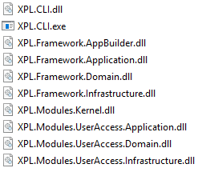

# Modular-Monolith with DDD - Multiple Clients

An example application and framework built in the modular monolith style with
a Domain-Driven Design approach, and Explicit Architecture.

## Why?

> "In theory, theory and practice are the same. In practice, they are not."

I created this project as an exercise for myself to see if the way I imagined a modern architecture
actually played out that way when if sit down and code it up. *Unsurprisingly* I've learned a few things.

## Table of Contents

1. [Inspiration](#Inspiration)
1. [Code Quality](#code-quality)
   1. [Level: Code](#level-code)
   2. [Level: Methods, Properties, and Fields](#level-methods-properties-and-fields)
   3. [Level: Classes, Interfaces, and Functions](#level-classes-interfaces-and-functions)
   4. [Level: Namespaces](#level-namespaces)
   5. [Level: Assemblies / Packages](#level-assemblies-packages)
   6. [Level: Bounded Contexts / Modules](#level-bounded-contexts-modules)

### Inspiration

**This is not an original idea.**

I was most inspired to try something like this after stumbling
across [Kamil Grzybek](http://www.kamilgrzybek.com/)'s excellent
repo [Modular Monolith with DDD](https://github.com/kgrzybek/modular-monolith-with-ddd).

In that repository Kamil does essentially this exercise where he builds an entire application (instead of demo-ware).
I will not repeat all that he's done in that repo because (a) it's a lot and (b) you should read it for yourself.

However, I have poured over most of his source code and there are certain things, not represented there,
which are of particular interest to me.

### Code Quality

Qualities we want in our codebase:
1. **Maintainable** Making a change in one area of the system impacts only that area
2. **Extensible** Adding new behavior to the system involves writing new code, not modifying existing code
3. **Testable** The system is structured in such a way that tests can be easily written to verify behavior
4. **Modular** The system is packaged in such a way that distinct components are logically separate and reusable
5. **Encpsulated** Each module of the system has complete ownership over the data and behaviors it represents
6. **Discoverable** Looking at any module of the system should provide feedback about how it used and what it does

These code qualities apply at **all** leveles of software.

#### Level: Code

- Coding style and alignment (.editorconfig)
- Naming conventions
- Avoiding branching / looping structures where possible
- Creating nested / local methods to split long segments
- Using language extensions
- Low astonishment
- Favor expressions over statements

#### Level: Methods, Properties, and Fields

- Descriptive method names
- Honest method signatures
- Correct method/property exposures
- Defense **by design**,  **not** defensive code
- Throw exceptions when necessary, not for control flow
- Program to an interface, not an implementation
- Follow [CQS](https://en.wikipedia.org/wiki/Command%E2%80%93query_separation)

#### Level: Classes, Interfaces, and Functions

- Descriptive or Conventional class names
- Follow [SOLID](https://en.wikipedia.org/wiki/SOLID) principles
- Expose projections of internal state as required for testing
- Encapsulate implementation
- Avoid primitive obsession with Value types
- Implement one cohesive behavior completely, delegating when needed
- Avoid high coupling
- Create pure functions to compliment immutable objects

#### Level: Namespaces

- Descriptive and consistent names and structure
- Logically partition the behavior
- Contain implementations and expose interfaces
- High discoverability
- Use to build logical components
- Contain classes with high cohesion

#### Level: Assemblies / Packages

- Consistent naming
- High discoverability
- Package Cohesion principles
   - REP: Release reuse equivalency (Reusable is releasable)
   - CCP: Common closure prin. (Classes that change together are packaged together)
   - CRP: Common reuse prin. (Classes used together are packaged together)
- Package Coupling principles
   - ADP: Acyclic dependencies prin. (No cyclic dependencies)
   - SDP: Stable dependencies prin. (Depend in the direction of stability)
   - SAP: Stable abstractions prin. (Stable packages are abstract packages)

#### Level: Bounded Contexts / Modules

- Current context in relation to other contexts
- Clean boundaries (minimal or no kernel)
- Clean communication
- Each context has a single Ubiquitous Language with absolutely no ambiguity in terminology or concepts
- Alignment to subdomains and business capabilities
- Follows CQRS by default
- The context is partitioned into components where applicable, each as independent as possible