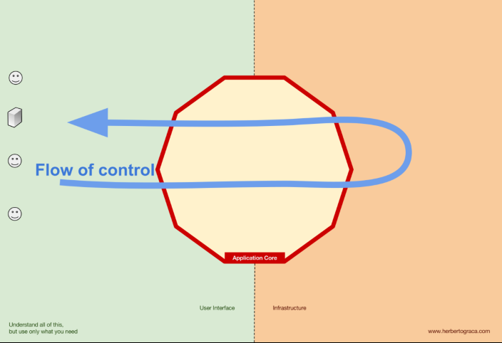

# Explicit Architecture

We will follow Uncle Bob's advice regarding the clean architectures dependency rule.

At the same time, we do not want to re-invent the wheel every time we need to interact with a Module (Bounded Context), or add a new one.

We can achieve both of these at the same time by creating our own framework classes.

Because I'm following the *Explicit Architecture,* I'm using the *XPL* prefix for all classes. (Plus it's nice and short.)

# Version 0.2

This is the first rewrite of this project. The very first version taught me a lot and also revealed some flaws.
As I sit here on 03/11/21 (*a year to the day* :pensive:) to begin the rewrite there are a few main things I know need to be done differently.
The prominent ones are listed here:

1. Keeping the implementation frameworks at arm's length too strictly bloats the code
   1. It'also innefficient because you end up reinventing the wheel and just being a pass through to the implemenetation anyway
   2. This time I'll take the approach of committing to a tool and building on top of it (but don't couple to it either)
2. I started in the wrong place when I attempted version 0.1
   1. I started with building out the shape of the source tree, and namespaces
      1. This is a problem because I'm not letting the design emerge organically
      2. Seriously, go look at the commit message for `7e559b28`...
   2. The namespaces and projects will build themselves out as needed
      1. Know when it's time to break a namespace into a project
      2. Also, know that some are already separate *Explicitly*

## Design (Round 2)

So let the hypocricy begin; Let's design.

### CQRS

Big picture the application will be reacting to commands and queries.
The benefits of separating these seems large, so the first thing to address is how they flow through the system.

These wonderful diagrams are all from [Herberto Graca](https://herbertograca.com/). Go read his blog.

There is the world outside of the application, and the world inside.
Let's think about the kinds of things that happen in these places as we followow the flow of control.
Focusing first on Commands:

**Observations**
1. The outside world is messy and not object-oriented
   1. Semantically invalid input should be rejected from the outset
   2. This implies outside the boundary
   3. Note: This should be logged
2. Logging
   1. This should happen globally for any transaction with the application
   2. This implies outside the boundary
   3. Previous obligation suggests this is the first in the pipeline
3. Semantic validation
   1. An obviously invalid command can be rejected immediately
   2. Observation: Contrary to "Commands are void methods" this implies that a command returns a result
      1. **All** commands return a result, successful or not
   3. Logging can be validation aware and log general success/failure
   4. Commands are under no obligation to succeed so there is no such thing as a pure `void` command at this level
4. Application layer needs to use Infrastructure layer to hydrate domain models
5. Use cases (in application layer) invoke domain methods or services to manipulate model
   1. These may fail for business reasons in order to protect invariants
   2. In order to protect invariants any attempted change to the domain model should be reverted in the event of an invalid command
      1. These should throw exceptions in order to ensure invariants are not compromised
   3. These exceptions have business meaning
      1. These exceptions can be caught in a general way that results in a failed command
      3. Exceptions from the business domain should contain information which is meaningful to the user
      4. In the event of an exception, and semi-mutated domainn classes should not be persisted
        1. This implies that the unit of work needs to wrap this interaction
6. After completion of the Domain task the Application layer should persist changes via the Infrastructure layer
7. A result payload (optional) is returned along with a successful result

This is deliberately simplistic so I have a starting point for the project. The command pipeline.

Items which come to mind (including those listed) are:
- Logging
- Transaction Management for persitence
- Unit of work which is in sync with persistence
- Domain event dispatching
- Integration event delivery
  - Outbox pattern
  - Background task?
- Sagas
- Authentication
- Authorization
- Command Validation (sub-cutaneous)

### 0.2.1 Command Pipeline

