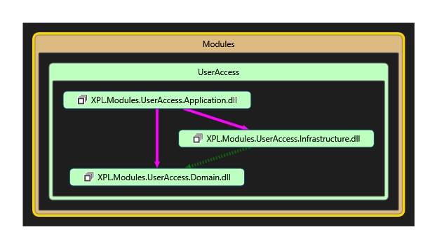

# Explicit Architecture

We will follow Uncle Bob's advice regarding the clean architectures dependency rule.

At the same time, we do not want to re-invent the wheel every time we need to interact with a Module (Bounded Context), or add a new one.

We can achieve both of these at the same time by creating our own framework classes.

Because I'm following the *Explicit Architecture,* I'm using the *XPL* prefix for all classes. (Plus it's nice and short.)

# Modules

In Modules (Bounded Contexts) the dependency rule is simple.

- The application layer refers to both the Infrastructure layer and the Domain layer.
- The Infrastructure layer refers to the Domain layer

- In fact, the only reason the Application assembly references Infrastructure directly is to register concrete Infrastructure implementations with
interface delcarations in the Domain layer.
- The Infrastructure layer refers to the Domain layer for the purposes of implementing services required by the domain layer.

#### Framework

The Framework assemblies have four assemblies setup slightly differently.

- The Framework Application layer defines:
  - Module Contract types (including `ICommand`, `ICommandHandler`, etc.)
  - Module Port types (including `IBus` and `ILogger`, etc.)
  - Application Startup classes (convenience classes for code that needs to run on application startup)
  - The base App type (from which individual applications will inherit)
- The Framework Domain layer defines:
  - Base Domain model types (like `Entity` and `IDomainEvent`)
  - The `IDomainEventDispatcher` interface
- The Framework Infrastructure layer defines:
  - Port implementations (hence the refence to the Application layer, like `InMemoryBus` and `DomainEventDispatcher`)
  - Infrastructure implementations including:
    - Unit of Work
    - Configuration
    - Mapping `repository` base type
    - Etc.

The AppBuilder assembly contains the code to bootstrap and configure a whole application together.
It is referred to by assemblies in the Presentation layer in order to configure and assemble the particular application being built.

# Connecting Modules to the Framework

The Module assemblies are free to reference Framework assemblies as long as they still follow the Dependency Rule.

- That is `Module.Domain` can refer to `Framework.Domain`, but nothing else because Domain is at the core.
- `Module.Infrastructure` can refer to `Module.Domain`, but also to `Framework.Infrastructure` and `Framework.Domain`
  - This is so that Module Infra classes can make use of Framework Infra classes to support Module Domain classes which use Framework Domain classes.
- `Module.Application` is similar, and can refer to any subordinate Module assembly, but also the Framework Application, Infrastructure, and Domain assemblies.

This layout of references is shown here:

# The Domain

TODO...

